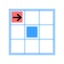

#  Timed-Squares

**Route:** `/projects/timed-squares`

A turn-based survival game on a 10x10 grid, recreated as a browser-playable page --
originally built in JavaScript/Processing and Python/Pygame, now HTML5 Canvas + vanilla
JS, embedded directly in a Flask template so it runs with nothing to install.

## Core rule: strictly turn-based, not real-time

You move exactly one cell per key press (arrow keys or WASD). The instant that move
resolves, every active obstacle takes its own move -- one step each, per its own pattern
-- then it's your turn again. A move into a wall is a no-op: nothing advances, because
nothing actually moved (see `tryMovePlayer` in `timed_squares.js`).

## Telegraphing: the actual design constraint

Every obstacle shows what it's about to do *before* it does it -- an arrow (rotated to
the exact `{dx, dy}` it will execute next), or, for the L-mover, that same precisely-
aimed arrow plus a small ring marking it as the trickier pattern. This isn't cosmetic:
the whole game is meant to be dodgeable by reading the board, not memorizing it, so the
arrow has to point at the *real* upcoming move, not a generic "this is a jumper" icon.
Each obstacle's `nextMove` is decided once at spawn (so the very first render already
shows an arrow) and re-decided immediately after it executes a move -- never both in the
same step, which is what keeps "shown, then resolved next turn" strictly true turn over
turn.

## Obstacle types

| Type | Pattern |
|---|---|
| Standard | 1 cell/turn, straight line |
| Jumper | 2 cells/turn, straight line -- can jump over an intervening cell (including the player) without colliding with it |
| L-mover | A knight-style hop each turn: always makes net progress along its spawn-edge axis, with the perpendicular offset's sign chosen fresh each turn -- unpredictable path, but every single hop is exactly telegraphed |
| Diagonal | 1 cell/turn diagonally, keeping the inward component from its spawn edge |
| Bouncer | 1 cell/turn straight, reverses direction the instant its *next* step would leave the board -- decided at telegraph time, so it never actually executes a move that would exit |

## Difficulty scaling

Both the spawn rate and *what* can spawn widen with turns survived (`timed_squares.js`,
tuned by playtesting rather than a spec'd formula -- see the build prompt's own
"feel-based tuning" allowance):

- Spawn chance per turn rises with turns survived, plus a forced spawn every fixed
  number of turns so escalation isn't purely probabilistic.
- Which grid edges obstacles can enter from widens over time (top only, early; all four,
  later) -- matches "obstacles begin appearing from a wider variety of sides."
- Obstacle types unlock progressively (standard first, harder patterns later), so the
  early game teaches one pattern at a time instead of throwing all five at once.

## Public leaderboard

Same anonymous/public pattern as the Trading Simulator's shared trade book: no login, a
random per-visitor `session_id` cookie only exists to scope rate limiting, every score
(across every visitor) is visible to everyone. A short arcade-style display name is
sanitized by `validators.py: sanitize_arcade_name` -- a different shape of check than
Pipeline World's name fields (digits allowed, e.g. "P1AYER"), and one that **falls back
to "ANON" instead of rejecting the submission** on anything invalid: the score was
already earned by actually playing, so a malformed name shouldn't cost the player that,
the way a malformed field should block a *form* submission before anything of value has
happened.

**No server-side replay validation.** `POST /api/scores` only checks the submitted
`turns_survived` is a plausible non-negative integer under a configured ceiling
(`TIMED_SQUARES_MAX_TURNS`) -- a determined visitor could POST a fabricated high score
directly to the API. Accepted as a documented simplification at this scope, the same
"simulation only" spirit as the Trading Simulator having no real money on the line,
applied to a leaderboard number instead of a dollar figure.

## Try it

Play a round, dodge the standard movers early on and watch for the harder patterns
(jumper, L-mover, diagonal, bouncer) unlocking the longer you survive. Submit a score
and it lands on the shared leaderboard immediately for every visitor to see.

## Key files

- `app/blueprints/timed_squares/routes.py` -- page, `GET /api/leaderboard`, `POST /api/scores`
- `app/static/js/timed_squares.js` -- the whole game engine + page wiring, no dependencies
- `app/templates/timed_squares/index.html`
- `app/models.py: TimedSquaresScore`
- `app/services/validators.py: sanitize_arcade_name`

## Tests

`tests/test_timed_squares.py` -- score submission (persistence, rank, leaderboard
ordering/cap, input validation), and the arcade-name sanitizer (uppercasing, the ANON
fallback for blank/invalid/profane input, truncation instead of rejection). The game
engine itself has no Python test coverage (it's client-side JS with no test runner
wired up in this repo) -- it was instead verified directly in a real browser: driving
`tryMovePlayer` calls and dispatching real `keydown` events end to end confirmed
collision detection, the telegraph-then-execute sequencing (an obstacle's position after
resolving always matches exactly what its arrow showed beforehand), the bouncer's
edge-reversal (flips direction only once its *next* step would leave the board, never
executes a move that exits), and the L-mover's knight-shaped hop with correct
primary-axis progress -- plus the full page wiring (keydown -> move -> HUD update ->
game-over overlay -> score submission -> live leaderboard refresh).
