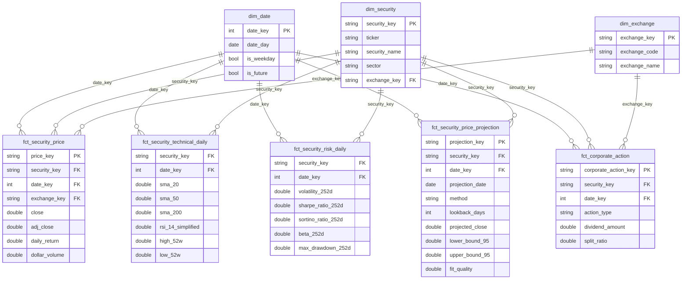

# Dimensional Modeling & dbt in This Project

This document explains, from first principles, what dimensional modeling
is, what dbt actually does, and exactly how every piece of this project
maps onto those ideas. It's written to be read top to bottom by someone
who knows SQL but hasn't necessarily built a warehouse before.

---

## 1. What "dimensional modeling" actually is

Dimensional modeling (the Kimball method, the dominant approach used in
real data warehouses) organizes data around **business questions**
instead of around how the source system happened to store it. Two kinds
of table:

- **Fact tables** — the *measurements*. Numbers you sum, average, or
  compare: a price, a return, a dividend amount. Each row is one
  observation.
- **Dimension tables** — the *context* those measurements are sliced by.
  Who, what, where, when. A security, an exchange, a calendar day.

A fact table is a long, narrow list of numbers with **foreign keys**
pointing at dimensions. You never repeat "Apple Inc., Technology,
Nasdaq" on every one of Apple's 11,000+ price rows — that lives once in
`dim_security`, and the price row just carries a `security_key`. That's
normalization for a specific purpose: keep the facts small and fast, and
keep descriptive attributes in one place so they can't drift out of sync.

### The single most important concept: **grain**

The grain of a fact table is the answer to "what does one row mean?"
Every design decision in this project traces back to grain. Get the
grain wrong — mix two different meanings of "one row" in the same table
— and every aggregate built on top of it is subtly wrong in a way that's
hard to detect later. Before adding any column to any fact table in this
project, the first question was always: **does this share the existing
grain, or does it need its own table?**

### Surrogate keys

Every dimension has its own key (`security_key`, `date_key`,
`exchange_key`) that isn't the natural business key (`ticker`,
`trade_date`, `exchange_code`). This project generates them with
`dbt_utils.generate_surrogate_key(...)` — a deterministic hash of the
natural key, so the same ticker always gets the same surrogate key
without needing an auto-increment sequence or a lookup table maintained
by hand. `date_key` is the one exception: it's a plain `yyyymmdd`
integer (20260910) rather than a hash, computed identically in
`dim_date` and every fact, specifically so facts can carry it without a
join — see §4.

### Conformed dimensions

"Conformed" means every fact table that needs to know about securities
uses the *same* `dim_security`, with the *same* `security_key` values —
not five different tables each with their own idea of what "Apple"
means. This is what lets you join `fct_security_price` and
`fct_security_risk_daily` to each other through `dim_security` and get a
consistent answer. All five fact tables in this project share exactly
three conformed dimensions: `dim_date`, `dim_security`, `dim_exchange`.

---

## 2. What dbt actually does

dbt (data build tool) is not a database — it's a compiler and a test
runner that sits on top of one (DuckDB, MotherDuck, or Snowflake here,
interchangeably). Concretely, in this project:

1. **You write `SELECT` statements**, not `CREATE TABLE`/`INSERT`. Each
   `.sql` file under `models/` is one query defining one table or view.
   dbt figures out the dependency order from `{{ ref('other_model') }}`
   calls and builds everything in the right sequence.
2. **Materialization** is a one-line config choosing what that query
   becomes: `view` (staging — cheap, always fresh, no storage) or
   `table` (marts — pre-computed, fast to query, rebuilt each run). This
   project's whole marts layer is `table`, full-refresh every run —
   deliberately, documented in `HARDENING.md`, because at ~95K rows a
   full rebuild takes under a second. Real warehouses at billions of
   rows use `incremental` materialization instead (append/merge only
   new data); premature here.
3. **Tests are just assertions written as `SELECT` queries that should
   return zero rows.** `unique`, `not_null`, `relationships`,
   `accepted_values` are generic, reusable ones; a `.sql` file under
   `tests/` is a one-off "singular" test. This project runs 85 of them
   on every build (`unique_combination_of_columns` for grain, `not_null`
   + `relationships` for every key, range checks on measures, and
   several singular tests like "high must be >= low").
4. **`ref()` and `source()` build a dependency graph** (the DAG), so
   `dbt docs generate` can draw exactly what depends on what, and
   changing one model's SQL doesn't require you to manually figure out
   what needs rebuilding after it.
5. **Snapshots** (`snapshots/security_info_snapshot.sql`) are dbt's
   mechanism for turning a table that only shows the *current* state
   into one that preserves *history* of changes — see SCD-2 in §3.
6. **The same SQL runs on three engines** (DuckDB, MotherDuck, Snowflake)
   because dbt compiles the Jinja templates + macros down to each
   engine's dialect at build time, and this project deliberately avoided
   any function one engine has and another doesn't (see
   `dim_date.sql`'s hand-rolled day-of-week math instead of each engine's
   own `DAYOFWEEK()`, which disagree).

dbt does not decide the dimensional model for you. Everything in §1 —
what's a fact, what's a dimension, what the grain is — is a design
decision made once, by hand, in the `.sql` file; dbt just compiles it,
runs it in dependency order, and checks it against the tests.

---

## 3. The schema, as built



### Dimensions

| Table | Grain (one row =) | Type | Notes |
|---|---|---|---|
| `dim_date` | one calendar day | Static, pre-generated | 1960-01-01 to 2035-01-01. Includes **future** dates (`is_future`) so `fct_security_price_projection` has real calendar days to project onto — see §5. |
| `dim_security` | one instrument | **SCD type 1** (current attributes only) | Left-joins to `dim_exchange`; unmapped exchange codes get an `UNKNOWN` member so the join never drops a row. |
| `dim_exchange` | one exchange | Conformed, seed-enriched | From `seeds/seed_exchange.csv` plus an `UNKNOWN` catch-all. |

**SCD type 1** means `dim_security` only ever shows the *current* sector,
name, etc. — an update overwrites the old value, no history kept in this
table. History of those same attributes is captured separately by
`snapshots/security_info_snapshot.sql`, a dbt **snapshot**: every dbt run,
it compares the incoming row to what it saw last time, and if the
watched columns changed, it closes out the old version (`dbt_valid_to`)
and opens a new one — that's an **SCD type 2** pattern, done today for
history-keeping even though nothing downstream reads it yet (a
deliberate "build the mechanism before you need the feature").

### Facts

All five share `dim_security`/`dim_date` as conformed dimensions. Four
of them share the *exact same grain* as `fct_security_price` — this is a
Kimball **fact table family**: separate tables, identical grain,
joined trivially through the shared keys.

| Table | Grain (one row =) | Why it's separate from `fct_security_price` |
|---|---|---|
| `fct_security_price` | security × trading day | The atomic transaction fact — raw OHLCV plus the cheapest possible derived measures (return, gap, dollar volume). Everything else depends on this one. |
| `fct_security_technical_daily` | security × trading day | Same grain, but these are *derived signals* (moving averages, RSI, Bollinger, 52-week range) that get tweaked and added to far more often than raw price ingestion changes. Splitting them means iterating on an indicator never risks the stable, heavily-tested price fact. |
| `fct_security_risk_daily` | security × trading day | Same grain again, but a different **persona**: risk-adjusted-return metrics (volatility, Sharpe, Sortino, max drawdown, beta) answer "how much could this lose," not "where is it trending." Kept apart from the technical fact for that reason even though the grain is identical. |
| `fct_security_price_projection` | security × **future** trading day × **method** × **lookback window** | Different grain on purpose, and wider than it first needed to be — see §5. |
| `fct_corporate_action` | security × action (dividend or split) × date | A genuinely different grain: sparse (not every security has an action every day), and a union of two source feeds (dividends, splits) that share a shape (`action_type` discriminator) rather than needing two tables. |

---

## 4. Why `date_key` is a plain integer, not a hash

Every other surrogate key in this project is
`generate_surrogate_key(...)`. `date_key` isn't — it's
`yyyymmdd` computed identically, by the same `EXTRACT(...)` arithmetic,
in `dim_date` and in every fact's own `SELECT`. That's a deliberate
departure: it means a fact can join `dim_date` for calendar attributes
*and* still carry a date identity if the join is ever skipped, and two
independently-written models can never disagree about what a given
date's key is, because neither one is "the source of truth" for the
hash — the formula is the source of truth, copy-pasted (not `ref()`'d)
into each place that needs it.

---

## 5. The trickiest modeling decision: the projection fact

`fct_security_price_projection` is **not** at the same grain as the
other facts, and getting there required changing a dimension.

**The problem:** a linear trend projection needs to write rows for
*future* trading days — days that haven't happened yet. `dim_date`
originally stopped at `current_date` (a reasonable-looking limit, until
this feature needed it not to). The projection model's first build
returned **zero rows**, silently, because its join to `dim_date` for
future dates matched nothing.

**The fix:** `dim_date`'s spine already generated dates out to
2035-01-01 (chosen generously up front); the fix was to stop *filtering
them out*, and add `is_future` so anything that only wants realized
history can filter itself. This is the kind of thing that's obvious in
hindsight and easy to miss in advance — a good example of why "check
what's actually in the table" beats "reason about what should be in the
table" once queries return unexpectedly empty results.

**The grain, once dates existed:** *(security, future trading day,
method, lookback window)* — four parts, not two. It started as
*(security, future trading day)* with one hardcoded method; adding a
second dimension of real variation (which forecasting method, over how
much history) meant the grain had to grow to match, the same way adding
`fct_security_technical_daily` didn't get to reuse `fct_security_price`'s
table just because the keys matched.

**Why `method` and `lookback_days` are grain, not a WHERE clause on one
precomputed answer:** a 30-day linear trend and a 180-day linear trend
are *different claims*, derived from different inputs — collapsing them
into "the" projection and letting a UI parameter silently pick which
one to compute live would mean the warehouse is no longer the source of
truth, just a cache of whatever was asked for last. Precomputing the
full grid (3 methods × 4 lookback windows = 12 combinations per
security) keeps the "dbt computes and tests everything, Flask only
displays" discipline intact — the dashboard's method/timeframe pickers
are `WHERE method = ? AND lookback_days = ?` filters over rows that
already exist and already passed 15 dbt tests, never a live calculation
triggered by a page click.

**Three methods, one banding treatment** (full detail in the model's
own docstring): `linear_trend` (OLS regression of `ln(close)` on a day
index — momentum), `random_walk_drift` (the textbook no-skill forecast
baseline: last price × the *average* historical daily return, not a
regression), and `mean_reversion` (an AR(1)/Ornstein-Uhlenbeck estimate
— regress each day's deviation from its trailing mean against the
*previous* day's deviation; the slope is a reversion speed, clipped to
`[0, 0.999)` so it can't blow up or flip sign). All three anchor to the
same last actual price and share the same volatility-derived, sqrt(time)
-widening confidence band from `fct_security_risk_daily` — a fact
depending on another fact, perfectly normal in dbt as long as grains are
respected — so only the *central* assumption differs between methods,
not the uncertainty treatment. Verified qualitatively, not just by tests
passing: for AAPL, `linear_trend` and `random_walk_drift` both project
*above* the last close (recent momentum was positive), while
`mean_reversion` projects *below* it, pulling back toward the trailing
mean — the three methods visibly disagree, which is the honest point of
offering more than one. `fit_quality` (an R², null for
`random_walk_drift`, which has no analogous statistic) is carried
through so a bad fit is visible — several ticker/lookback combinations
score under 0.1. **These are trend extrapolations under three different
assumptions, not forecasts — see the model's docstring and the page's
own disclaimer.**

---

## 6. Where every piece lives

```
market-data-warehouse/
  warehouse/
    dbt_project.yml                 materialization config + vars
                                     (risk_free_rate, benchmark_ticker,
                                      projection_lookback_days, ...)
    profiles.yml                     duckdb / motherduck / snowflake connections
    models/
      staging/                      typed, de-duplicated views over RAW
        stg_prices.sql / stg_dividends.sql / stg_splits.sql / stg_security_info.sql
      marts/core/                   the star schema itself
        dim_date.sql
        dim_security.sql
        dim_exchange.sql
        fct_security_price.sql
        fct_security_technical_daily.sql
        fct_security_risk_daily.sql
        fct_security_price_projection.sql
        fct_corporate_action.sql
        _core.yml                   every column's tests + docs
    snapshots/
      security_info_snapshot.sql    SCD-2 history of dim_security's source data
    seeds/
      seed_exchange.csv             the exchange reference data
    tests/                          singular tests (grain sanity checks, orphan guards)
  ingest/                           yfinance -> RAW (not part of the dimensional model itself)
```

On the Flask side, `app/services/market_warehouse.py` reads the marts
layer directly with plain `SELECT`s (joins across the fact-table family
exactly as described above) — it never writes to the warehouse, and it
never re-derives anything dbt already computed.

---

## 7. If you extend this further

Before adding anything, ask the §1 question again: **what does one new
row mean, and does that match an existing fact's grain?**

- Same grain as price (something else true of a security on a given
  trading day) → a new member of the fact table family, same pattern as
  `fct_security_technical_daily`.
- A slowly-changing attribute of a security (more fundamentals: P/E,
  market cap) → new columns on `dim_security` (SCD-1) plus the existing
  `security_info_snapshot` picks up history for free — no new table
  needed, see `HARDENING.md`'s note on this.
- A sparse, event-shaped thing (earnings dates, analyst rating changes)
  → its own fact at that event's natural grain, not folded into
  `fct_corporate_action` (which is specifically completed cash/structural
  events, not scheduled/estimated ones).
